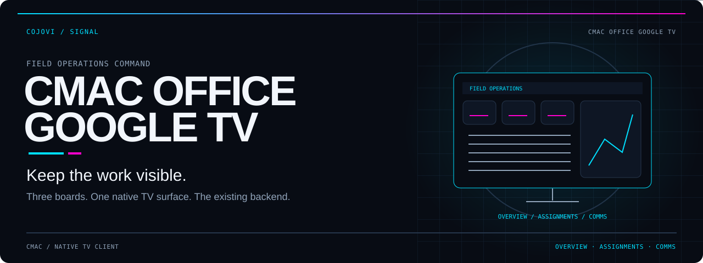
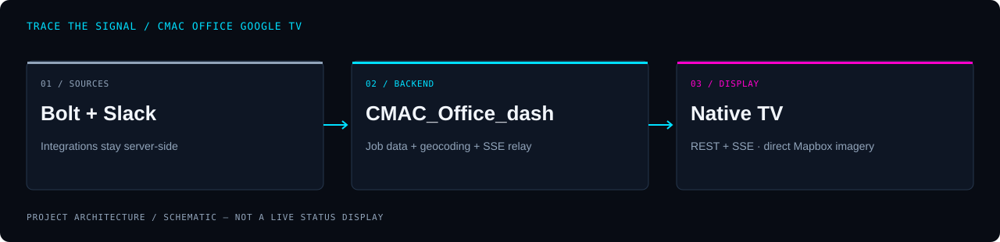

<!-- COJOVI / SIGNAL — CMAC Office Google TV edition. Ship with readme-assets/. -->
<a name="top"></a>

<p align="center">
  
</p>

<h1 align="center">CMAC Office Google TV</h1>

<p align="center">
  <strong>Keep the work visible. Put the dashboard on the wall.</strong><br>
  A native Google TV / Android TV client for CMAC Field Operations Command.
</p>

<p align="center">
  
</p>

<p align="center">
  <a href="#overview">Overview</a> ·
  <a href="#architecture">Architecture</a> ·
  <a href="#quickstart">Quickstart</a> ·
  <a href="#configuration">Configuration</a> ·
  <a href="#remote-controls">Remote controls</a> ·
  <a href="#validation">Validation</a> ·
  <a href="#security">Security</a>
</p>

---

<a name="overview"></a>
## `> meet_the_tv_client`

**Three boards. One native TV surface. The existing backend.** This repository replaces the browser presentation of `CMAC_Office_dash` with a Kotlin / Jetpack Compose application: operations overview, paged assignments, and field communications.

| See the territory | Follow the assignments | Keep the conversation visible |
| :--- | :--- | :--- |
| Mapbox dark imagery, work-type-colored job pins, and animated counts. | An automatically paged roster with address, community, office, work types, crew, and status. | Eight recent mentions on Overview, twelve on Comms, and recent-message highlighting. |

The custom HUD uses bundled Orbitron and Rajdhani fonts, scanlines, corner brackets, and a **1920 × 1080 design space** scaled to the display. It uses Compose UI/foundation rather than Material components. The activity requests immersive fullscreen and keep-screen-on while displayed.

> [!IMPORTANT]
> **This is a client, not the server.** Keep `CMAC_Office_dash` running. Bolt credentials, job-detail retrieval, geocoding, and the Slack WebSocket relay stay on that server. The TV calls its REST/SSE endpoints and separately requests Mapbox static imagery with a public token.

<a name="architecture"></a>
## `> trace_the_signal`

<p align="center">
  
</p>

```text
Bolt + Slack                  Existing CMAC_Office_dash
                              ├─ job retrieval + geocoding
                              └─ REST API + Slack-to-SSE relay
                                          ↓
                              Native TV dashboard
                              ├─ polling + SSE + saved snapshot
                              ├─ Overview / Assignments / Comms
                              └─ Mapbox Static Images over HTTPS
```

### Client API contract

All routes are relative to `CMAC_SERVER_URL`; trailing slashes are trimmed. The client sends `Accept: application/json` for REST, and `Accept: text/event-stream` plus `Cache-Control: no-cache` for SSE. It does **not** configure an authorization header or interactive login.

| Route | Payload consumed by the TV |
| :--- | :--- |
| `GET /api/jobs/counts` | `gutterCount`, `reroofsCount`, `garageDoorsCount`, `tractRoofingCount`, `totalJobs`, `updatedAt`. |
| `GET /api/jobs/today` | `jobs`, `total`, `updatedAt`; each job has `job_number`, `address`, `community`, `office`, `stage`, `work_order_types`, `crews`, `lat`, `lng`. |
| `GET /api/slack/mentions` | `mentions` with `user`, `text`, `timestamp`, `channel`, `permalink`. |
| `GET /api/events` | JSON envelopes: `{"type":"mention","mention":{...}}` or `{"type":"jobCounts","data":{...}}`. |

Models supply defaults for missing fields and ignore unknown keys; this is not a guarantee that arbitrary malformed payloads parse. SSE uses the JSON envelope's `type`, not the SSE event-name field; malformed/unrecognized events are ignored. There is no event-ID replay implementation. Mention ordering uses `timestamp`; a separate Slack `ts` field is ignored by the model.

<a name="quickstart"></a>
## `> bring_it_online`

**Prerequisites:** a running compatible backend reachable from the TV, Git, JDK 17+, Android SDK 36, Android platform-tools (`adb`), and a Google TV / Android TV device with API 26 or newer. Match the pinned toolchain rather than assuming any installed Android Studio version will work.

| Build setting | Declared value |
| :--- | :--- |
| Gradle wrapper / Android Gradle Plugin | `9.5.0` / `9.3.1` |
| Compose and serialization compiler plugins | `2.4.0` |
| Compose BOM | `2026.06.01` |
| Android SDK | Compile/target `36`; minimum `26` |
| Java source/target | `17` |
| Application ID / version | `com.cmac.opscommand` / `1.0.0` (code `1`) |

AGP 9 provides built-in Kotlin support; the project deliberately does not apply `org.jetbrains.kotlin.android`. These are source declarations, not a verified toolchain compatibility report.

### 1. Get the source and configure the build

```bash
git clone https://github.com/cojovi/cmac_office_googletv.git
cd cmac_office_googletv
```

Create **`local.properties`** in the repository root; replace these safe examples with your deployment values:

```properties
sdk.dir=/absolute/path/to/Android/Sdk
CMAC_SERVER_URL=https://dashboard.example.com
CMAC_MAPBOX_TOKEN=pk.REPLACE_WITH_PUBLIC_TOKEN
```

The server URL must resolve from the **TV**, not just your workstation. On Windows, use the local SDK path with forward slashes, such as `C:/Users/YOUR_USER/AppData/Local/Android/Sdk`. Leave `CMAC_MAPBOX_TOKEN` blank if no map is needed.

### 2. Build a development APK

```bash
./gradlew assembleDebug
```

On Windows use `gradlew.bat`. The debug APK is `app/build/outputs/apk/debug/app-debug.apk`.

### 3. Install and open on the TV

Enable developer options (typically Settings → System → About → select Build seven times), then the debugging options provided by that device. Authorize the workstation. Network-debugging menus and pairing requirements vary by firmware; use the TV's displayed address/port or a supported USB connection.

```bash
# Example host only; replace with your TV's debugging address.
adb connect tv.example.com:5555
adb install -r app/build/outputs/apk/debug/app-debug.apk
adb shell am start -n com.cmac.opscommand/.MainActivity
```

The manifest registers `LEANBACK_LAUNCHER` and a `BOOT_COMPLETED` receiver. The receiver **attempts** to relaunch the activity; verify reboot behavior on the actual device. This is not a device-owner kiosk, launcher replacement, or guarantee against Android/OEM background-start restrictions.

<a name="configuration"></a>
## `> configure_the_display`

| Input | Behavior |
| :--- | :--- |
| `CMAC_SERVER_URL` | Required backend base URL. A blank value displays `SERVER NOT CONFIGURED` and does not start the repository. |
| `CMAC_MAPBOX_TOKEN` | Optional public Mapbox `pk.` token for Static Images. A blank value displays `MAP UNAVAILABLE / SET CMAC_MAPBOX_TOKEN`. |
| `sdk.dir` | Android SDK location in `local.properties`; not an application setting. |

**These values are compiled into the APK.** There is no in-app configuration screen. Rebuild and reinstall after changing the server URL or token. `CMAC_MAPBOX_TOKEN` becomes `BuildConfig.MAPBOX_TOKEN`; the server setting remains `BuildConfig.CMAC_SERVER_URL`.

Configuration resolution in `app/build.gradle.kts` is:

1. `local.properties`.
2. Gradle project properties, including `-P` flags and `gradle.properties`.
3. Environment variables.
4. An empty string.

> [!WARNING]
> **Blank properties still take precedence.** The checked-in `gradle.properties` declares both deployment keys as blank, so environment variables are normally masked. Likewise, a key in `local.properties` wins over `-P`, even when blank. Omit a key from higher-priority files if you intend to use a lower-priority source.

For a command-line build, first remove that key from `local.properties`:

```bash
./gradlew assembleDebug -PCMAC_SERVER_URL=https://dashboard.example.com
```

Keep real endpoints and tokens in local deployment configuration, not tracked examples. Use simple URL/token values: the Gradle script interpolates them directly into generated string literals without explicit escaping.

<a name="remote-controls"></a>
## `> take_the_remote`

| Key | Action |
| :--- | :--- |
| Right / Media Next / Page Down | Next board. |
| Left / Media Previous / Page Up | Previous board. |
| OK / Enter / Numpad Enter / Space / Play-Pause | Toggle hold/resume for board rotation and automatic roster paging. |
| Down / Up | Switch to Assignments and move the roster forward/backward. |
| `1` / `2` / `3` | Jump to Overview / Assignments / Comms. |

Boards rotate every **15 seconds**. The roster advances every **5 seconds**, only while Assignments is visible and not locked. Rows per page follow the measured table height; the roster position is retained between board visits within the running ViewModel, not saved across restarts.

Manual navigation does **not** automatically enable hold or reset the timer. Press OK to hold a board before reading it. Locking does not stop polling or SSE updates. Keys are global actions; Back/Home retain platform behavior rather than enforcing a kiosk lock.

<a name="resilience"></a>
## `> read_the_health_signals`

| Mechanism | Source behavior |
| :--- | :--- |
| Counts + mentions polling | Concurrent requests at startup; wait 5 minutes after a successful round. Failure waits: 20, 40, 80, then 160 seconds. |
| Roster polling | Independent request at startup; wait 30 minutes after success. Failure waits: 5, 10, then 20 minutes. |
| REST timeouts | 10-second connect timeout; counts/mentions read timeout 60 seconds, roster 600 seconds. Total call deadlines are 90 and 630 seconds respectively. |
| SSE reconnect | Retry delay grows from 6 to 30 seconds; any received stream event resets the attempt counter. No streaming read timeout. |
| SSE recovery/disconnection | Wakes the **fast** poll loop; does not force a roster refresh or interrupt a request already running. |

Intervals are waits after work completes, not fixed wall-clock schedules. Fast polling considers the round successful when **either** counts or mentions succeeds; a partial failure therefore does not enter its failure backoff.

### What the header does—and does not—prove

- `DATA SYNCING` is the initial state. `DATA LIVE` means at least one fast endpoint succeeded in the latest round; `DATA STALE` means both failed. **Roster failures do not change this indicator.** Check the roster's `AS OF` timestamp too.
- `SLACK ONLINE / LINKING / OFFLINE` reflects the TV-to-server SSE connection, **not** independently verified Slack upstream health.
- `SYS ACTIVE` is always displayed as active; it is not a backend health probe.
- Times use the TV's system timezone. Recent-message styling uses a three-hour timestamp window.

### Saved data is a fallback, not an offline guarantee

The app stores counts, jobs, roster timestamp, and mentions in `filesDir/dashboard_snapshot.json`. It restores this snapshot at startup and writes it after successful fast polling or roster retrieval. SSE-only changes are not immediately persisted. Mentions are deduplicated by user/timestamp/text, sorted newest-first, and capped at 60.

There is **no snapshot expiry, backend-URL namespace, or encryption layer in this implementation**. Cached data may belong to an earlier day or deployment; clear app storage when repurposing a TV or switching backend. A failed/corrupt cache read is ignored. Coil separately uses `cacheDir/map_cache` with a 32 MiB disk limit and a memory-cache budget of 20% of available app memory; cached imagery can be evicted and a changed map request may need the network.

<a name="limitations"></a>
## `> know_the_edges`

**Roster cost belongs to the backend.** The original documentation and source comments report expensive cold-cache `/api/jobs/today` builds, per-job Bolt detail/geocoding fan-out, and HTTP 429s. Those production observations are not newly verified here. The TV's longer timeout and slower polling reduce pressure; they do not fix server-side rate limiting. Avoid repeated restarts as a refresh strategy.

Server-side follow-up remains: cache job details and geocodes, increase roster-cache lifetime, and review concurrency/retry jitter. The backend implementation is not included in this repository, so verify its current behavior before changing it.

**Framing is not geocoding correction.** The original documentation reports incomplete address fields producing out-of-state matches. Fix city/state/postcode extraction and service-area bias or bounds on the backend. The TV uses a 3rd–97th percentile camera frame when there are at least 12 valid points; smaller sets use ordinary bounds. Off-frame points are retained in the dataset and counted as `N OF M PINS OUTSIDE FRAME`, but not visible outside the clipped map. Jobs with null, invalid, or effectively `(0,0)` coordinates have no map pin; their roster rows remain.

**The map is static imagery, not interactive Mapbox GL.** It uses `mapbox/dark-v11` with a local animated pin layer; there are no extruded 3D buildings, map gestures, or camera fly-in. The YouTube mini-player from the browser dashboard is not implemented, and there is no player configuration flag.

<a name="validation"></a>
## `> check_before_you_ship`

From the repository root, in a configured Android development environment:

```bash
./gradlew testDebugUnitTest
./gradlew assembleDebug
./gradlew assembleRelease
```

`GeoTest.kt` covers Mercator projection, bounds/framing, and coordinate filtering. `ModelParsingTest.kt` covers REST/SSE payload parsing, defaults, and timestamp handling. These commands and test sources are present; **this documentation refresh did not run builds or tests** and makes no passing-suite or APK-size claim.

Release builds enable code minification and resource shrinking. **No release signing configuration is declared.** Configure private signing before distributing an installable production release; do not assume `assembleRelease` produces a signed deployment artifact.

- [ ] Verify the pinned toolchain resolves and both tests and builds complete.
- [ ] Confirm backend routes and payloads from the intended TV network.
- [ ] Check server URL/public token baked into the installed APK.
- [ ] Exercise all remote mappings, hold/resume, and roster pagination.
- [ ] Check 1080p/4K sizing, overscan, clock/timezone, and map placement on the target panel.
- [ ] Test cold start, slow roster response, network loss/recovery, cached-data age, and reboot behavior.
- [ ] Review API access controls, release signing, map attribution, and TV debugging exposure.

<a name="security"></a>
## `> draw_the_boundary`

| Protect | Deployment rule |
| :--- | :--- |
| Backend credentials | Bolt credentials, Slack credentials, and server geocoding configuration remain server-side. Never add private keys to the APK. |
| Public map token | Only a public `pk.` token belongs in `CMAC_MAPBOX_TOKEN`. APK contents are extractable; review Mapbox scopes, restrictions, and usage limits. |
| Transport and access | The manifest's network-security configuration permits cleartext **globally, including release builds**. Prefer HTTPS and a restricted network; this client has no built-in API authentication flow. |
| Operational data | Addresses, crews, and messages appear on the wall and in the saved snapshot. Restrict physical/device access; automatic Android backup is disabled, but that is not encryption. |
| Developer access | Limit ADB to authorized maintenance connections; disable unnecessary debugging after deployment. |
| Repository hygiene | Keep `local.properties`, `.env` files, keystores, signing configuration, and generated APKs private/out of source control. |

The static-image request disables Mapbox's embedded logo/attribution. Review applicable attribution requirements and the actual TV UI before distribution; a source comment alone is not proof of compliance. No repository license file was found in this revision—do not assume an MIT or other grant.

<a name="source-map"></a>
## `> explore_the_source`

| Location | Responsibility |
| :--- | :--- |
| [`app/build.gradle.kts`](app/build.gradle.kts) | Deployment properties, SDKs, dependencies, release settings. |
| [`MainActivity.kt`](app/src/main/java/com/cmac/opscommand/MainActivity.kt) / [`BootReceiver.kt`](app/src/main/java/com/cmac/opscommand/BootReceiver.kt) | TV window flags, global keys, boot-start attempt. |
| [`data/`](app/src/main/java/com/cmac/opscommand/data/) | Wire models, HTTP/SSE, polling, snapshot, map maths, timestamps. |
| [`ui/`](app/src/main/java/com/cmac/opscommand/ui/) | Boards, rotation, roster paging, fixed-stage layout, map, HUD theme. |
| [`CmacApp.kt`](app/src/main/java/com/cmac/opscommand/CmacApp.kt) | Coil image loader and map-image caches. |
| [`app/src/test/`](app/src/test/) | JVM projection and parsing tests. |

---

<p align="center">
  
</p>

<p align="center">
  <strong>The same operations. A native place on the wall.</strong><br>
  <sub>A <a href="https://github.com/cojovi">Cody / cojovi</a> project · <a href="https://cojovi.com">cojovi.com</a><br>
  CMAC Field Operations Command · Presented in COJOVI / SIGNAL.</sub>
</p>

<p align="center"><a href="#top">↑ Back to the signal</a></p>
